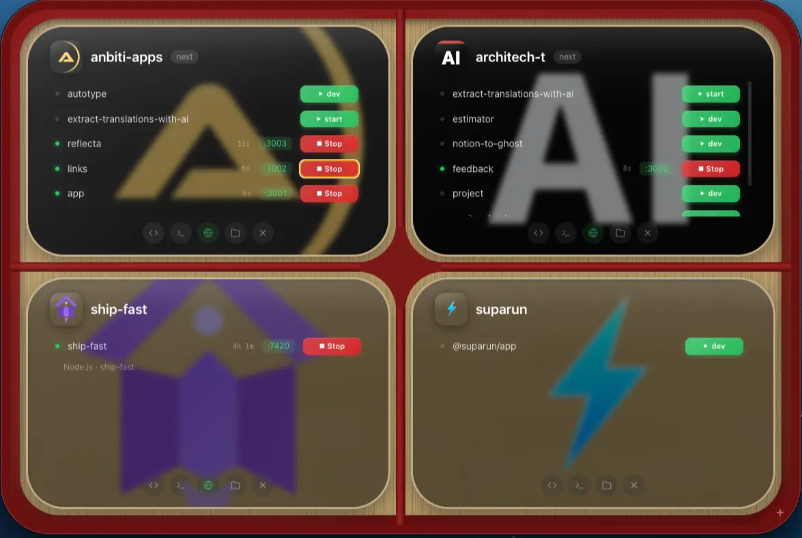

<p align="center">
  <h1 align="center">⚡ suparun</h1>
  <p align="center"><strong>Never restart <code>bun run dev</code> again.</strong></p>
  <p align="center">
    <a href="https://github.com/LivioGama/suparun/blob/main/LICENSE"></a>
    
    
  </p>
</p>

---

<h1 align="center">How<br/>many<br/>times<br/>did you<br/><sub>face this problem and didn't do anything about it? 🤯</sub></h1>
<p align="center"><em>That's the question I asked myself.</em></p>

<br/>
<br/>
<br/>

You're deep in flow. Something kills your dev server — a build tool, a port conflict, an IDE restart, a random crash. Or your non-obedient AI coding assistant casually runs `bun run dev` or `bun run build` — despite the F rules explicitly telling it not to. You don't notice for 5 minutes. Then you're debugging why your changes aren't showing up, only to realize the server died. *Again.*

## 💡 The Solution

```bash
bun run dev --hard
```

Suparun is a **watchdog daemon** that guards your port, auto-revives crashed processes, adopts servers started by other tools, and HTTP-pings to detect hung processes. Set it and forget it.

- 👁️ **Watch the port** every 2s — not just the PID
- 🧟 **Adopt external processes** — if your IDE started the server, suparun watches it too
- 🔄 **Auto-revive** the moment the port goes down or stops responding
- 🛡️ **Exponential backoff** on crash loops (gives up after 50)
- 🧹 **Clean shutdown** — kills the entire process tree, no orphans

## 📦 Install

```bash
bun add -g @suparun/cli
suparun init          # enables the --hard flag in your shell
```

### Usage

```bash
bun run dev --hard              # watchdog mode (works with npm/yarn/pnpm too)
bun run build --hard            # auto-retry on failure (3 attempts)
suparun dev --port 4000         # direct usage with port override
suparun uninstall               # remove shell hooks
```

Port is auto-detected from package.json scripts, `PORT` env, `.env` files, or framework defaults (Next.js → 3000, Vite → 5173, Astro → 4321).

## 🖱️ Desktop App

Optional **Electron desktop app** with a visual dashboard. Download from [Releases](https://github.com/LivioGama/suparun/releases) or build from source:

<p align="center">
  
</p>

One-click start/stop, live port status & uptime, system tray with global shortcut, macOS crash notifications, and processes that survive app restarts.

## 📄 License

[MIT](./LICENSE)
